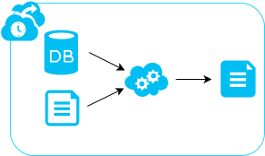
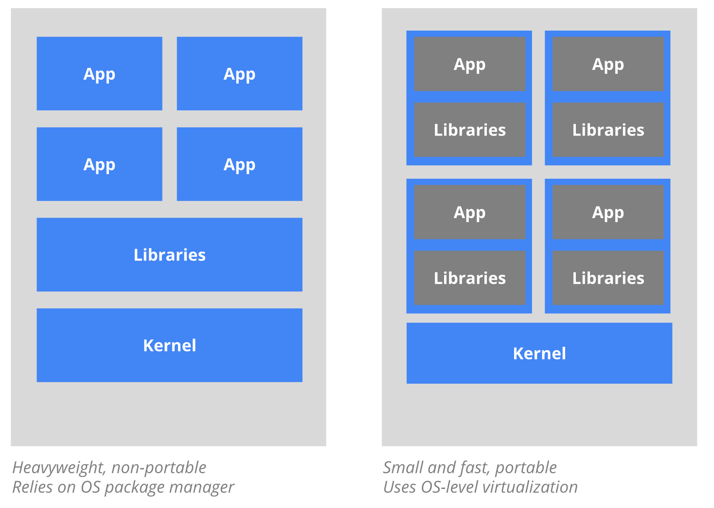
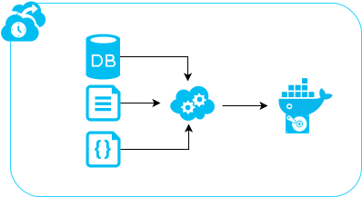
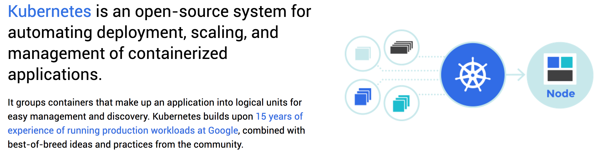
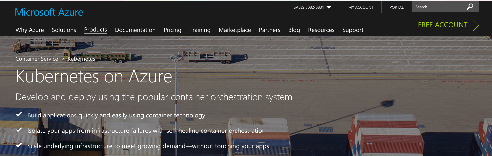
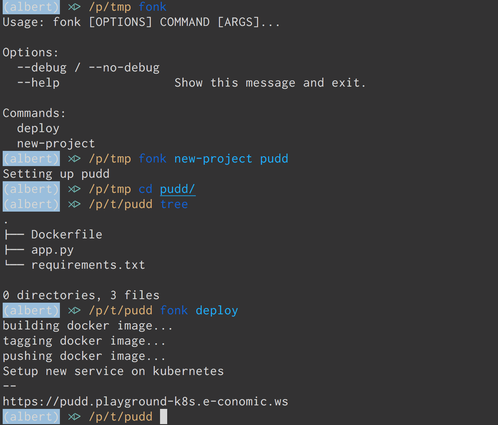

name: inverse
layout: true
class: center, middle, inverse

---
# Predictive services
## From data to production
<br>

Jonas Brunsgaard & Helge Munk Jakobsen   
.small[jonas.brunsgaard@visma.com]   
.small[helge.munk.jacobsen@visma.com]

September 4th, 2017 — PUDD   

.small[https://github.com/brunsgaard/berlin-talk-2017]   

---

layout: false

# Agenda

* Our team and our mission

* Going from data to prediction

 * Tools, techniques and processes

 * Magic explain while live coding

* From prediction to production

  * What goes into a hosted model (data, model, api, auth, metric, logging)

  * Where do we put stuff (the model is not part of the release, the model is like data, where should we load it from, s3, local)

  * Version misalignment, warming up the model, replacing a running model.

  * Why docker/kubernetes is a nice fit for the hosting part of this usecase

  * Lets deploy Helges model

* The idea of an end-to-end data science platform

* Conclusions

---

# About us

* Located in Copenhagen, e-conomic office

* We do Autosuggest and other custom solutions

#### Helge Munk Jakobsen

* Data wizard  TODO

#### Jonas Brunsgaard

* Interested in software arhitecture, elegant code and best practices

* Designing and building an upcomming end-to-end data science platform


---

template: inverse

# From data to prediction

---

# Helge section

---

layout: false

template: inverse

# From prediction to production

---

# Goal

Create and deploy an service there is

* tested
* versioned
* multi az
* easy to upgrade
* easy to rollback
* scalable
* ... (you get the idea ;) )

In short we have to align with VCDM.

# Constraints

* Python
* Scikit learn

---


# The naive approach

We create a application that loads the data and trains the model on runtime. 
.center[]

```python
import api

app = api.create(name='Berlin')

@app.route('/predict', method=['POST'])
def predict(request):
    model = Model()  # Naive Bayes is O(n)
    training_data = db.get_all_observed_events()
    model.train(training_data)
    return model.predict(request.json)

app.run()
```

---

# The naive approach

A CI is testing the application and releases an artifact which is run on a VPS
in the cloud, A provisioning system is used to setup the VPS and install the
software.

<br>.center[]


---

# The naive approach

Soon we experience that when data scales our solution starts to struggle


* Model training might be too slow and makes requests timeout
* Model training takes up an unhealthy amount of CPU time
* The server is running out of memory

## Notes regarding ML models

* The time complexity is at best `\(O(n)\)` (but often worse)
* Internal data structures might grow rapidly, (depending on the model)

---

# Async training approach

So we split the application in two components, the first component (shown
below) will continuously train new models and upload the serialized models to
s3 

<br>.center[]

---

# Async training approach

Now to provision an api server we take serialized trained\_model from s3 and
deserialize it into out api appilication

<br>.center[]

---

# Async training approach

We solved one problem, but introduced another.

Now when the application starts it reads the serilized scikit learn object.
If we change the model code or scikit learn or its dependencies are updated,
our models might not be deserializable anymore.

This solution is better than the naive approach, but now we have to 

keep meta information with the models about the _whole_ toolchain

This feel overcomplicated and is lacking robustness.

---

# Containers to the rescue


<br>.center[]

---

# A container based approach

Now instead of training models and storing them on s3, we now build container
images and store then in a docker regrestry.

<br>.center[]<br>

The images hold the api code, the trained\_models and all the dependencies.

---

# Docker in practice

.small[```Dockerfile
FROM visma/vml:1.0.0                 # base image with c/c++ deps

COPY code /code                      # copy the code
RUN pip install -r requirements.txt  # install deps
RUN python train_models.py           # train and serialize models 
RUN py.test --pyargs .               # test the modes

CMD ["code/app.py"]                  # run the application
```]

Then save it to the registry

.small[```bash
~ docker push vml.azurecr.io/model-nps:local.1499177682
```]

Now we have a registry with container images, how de we get a service out out
those?

---

# What is kubernetes

.center[]

--
.center[]

---
# What is kubernetes

Kubernetes can schedule and run application containers on clusters of virtual
machines, also it satisfies a number of common needs of applications running in
production, such as:

* Co-locating helper processes, facilitating composite applications and preserving the one-application-per-container model
* Mounting storage systems
* Distributing secrets
* Checking application health
* Replicating application instances
* Using Horizontal Pod Autoscaling
* Naming and discovering
* Balancing loads
* Rolling updates
* Monitoring resources
* Accessing and ingesting logs
* Debugging applications
* Providing authentication and authorization
---


# Kubernetes

An example of a kuberentes configuration

.small[```yaml
apiVersion: extensions/v1beta1
kind: Deployment
metadata:
  name: vml-model-albert-productinfo
spec:
  replicas: 3
  template:
    metadata:
      labels:
        app: vml-model-albert-productinfo
    spec:
      containers:
      - name: vml-model-albert-productinfo
        image: economic.azurecr.io/vml-model-albert-productinfo:local.1501853451
        imagePullPolicy: Always
        env:
        - name: AWS_CREDENTIALS
          valueFrom:
            secretKeyRef:
              name: albert-env
              key: aws_credentials
        ports:
        - containerPort: 80
```]

---

# A container based approach

A ci is building new images over time
<br><br>.left[]<br>
When kubernetes is notified about a new image it updates the service
<br><br>.center[]

---

# A container based approach

* Isolation (deps, model, python)
* Dockerfile in repo (testing on the data)
* Kubernetes file in repo (Rolling deployment)
* Scaling
* Usibility

---

# Scaffolding

* Chalice was the inspiration
* Enabeling Data scientists and other visma teams to deploy production grade models with new cli commands


.center[]
---

# Future work

The goal is to enable others to do data sciece

* Dashbord over models
* SaaS

---

# Conslusions
