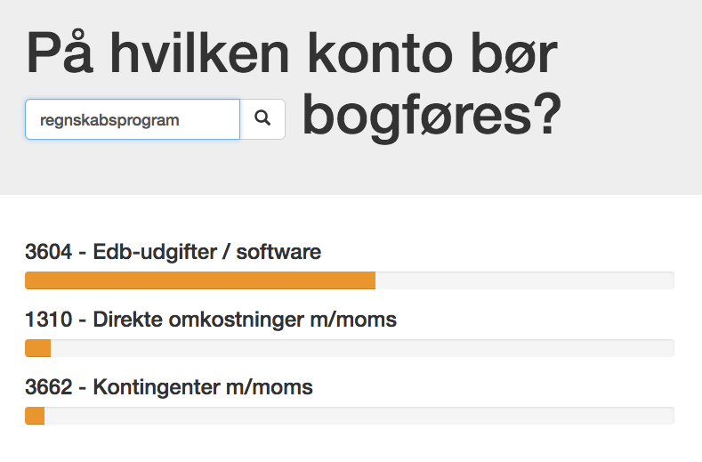

name: inverse
layout: true
class: center, middle, inverse

---
# Predictive services
## From data to production
<br>

Jonas Brunsgaard & Helge Munk Jakobsen   
.small[jonas.brunsgaard@visma.com]   
.small[helge.munk.jacobsen@visma.com]

September 4th, 2017 — PUDD   

.small[https://github.com/brunsgaard/berlin-talk-2017]   

---

layout: false

# Agenda

* Our team and our mission

* PART1: From **DATA** to **PREDICTION**

* PART2: From **PREDICTION** to **PRODUCTION**

* The idea of an end-to-end data science platform

---

# About us

* The Visma Machine Learning Team
* Located in Copenhagen (e-conomic office)
* Team headcount: 4
* Main focus: AutoSuggest

#### Helge Munk Jakobsen

* Interested in data and predictive modelling

#### Jonas Brunsgaard

* Interested in software arhitecture, elegant code and best practices
* Designing and building an upcomming end-to-end data science platform

---

template: inverse

# From **DATA** to **PREDICTION**

a gentle introduction to building predictive models aimed at developers

---

# Intro

Data -> Magic -> Prediction

---

# Intro

Data -> ~~Magic~~ Math + Code -> Prediction

---

# Hands on exercise

* **Goal:** Build account suggestion service

* **Example:** For "Taxi to conference" -> Travel expense account (maybe)

* No hardcoded rules

<br>.center[]

---

# The big picture

* Supervised learning (predictions)

* Classification

* One single type of model

<br>.center[]

<!-- ---

# The big picture

* Supervised learning (Prediction based on examples)
* Classification
* One single type of model
<br>.center[] -->

---

layout: false

template: inverse

# Let's code!

---

layout: false

template: inverse

# From **PREDICTION**
# to **PRODUCTION**

---

# Goal

Create and deploy an service there is

* tested
* versioned
* multi az
* easy to upgrade
* easy to rollback
* scalable
* ... 

In short, is has to be production grade.


# Constraints

* Scikit learn
* Python

---


# The naive approach

We create a application that loads the data and trains the model on runtime. 
<br><br>.center[]<br>

```python
import api

app = api.create(name='Berlin')

@app.route('/predict', method=['POST'])
def predict(request):
    model = Model()  # Naive Bayes is O(n)
    training_data = db.get_all_observed_events()
    model.train(training_data)
    return model.predict(request.json)

app.run()
```

---

# The naive approach

A CI is testing the application and releases an artifact which is run on a VPS
in the cloud, A provisioning system is used to setup the VPS and install the
software.

<br>.center[]


---

# The naive approach

Soon we experience that our solution starts to struggle as data scales

* Model training might be too slow and makes requests timeout
* Model training takes up an unhealthy amount of CPU time
* The server is running out of memory

## Notes regarding ML models

* The time complexity is at best `\(O(n)\)` (but often worse)
* Internal data structures might grow rapidly, (depending on the model)

---

# Async training approach

So we split the application in two components, the first component (shown
below) will continuously train new models and upload the serialized models to
s3 

<br>.center[]

---

# Async training approach

Now, to provision an api server we take serialized model from s3 and
deserialize it into our api appilication

<br>.center[]

---

# Async training approach

We solved one problem, but introduced another. 

**We have to serialize and deserialize in identical environments.**

That might introduce problems

 * if we change the model code
 * if scikit learn upgrade 
 * scikit learn dependencies are upgraded, 
 * a data scientist manually uploading a new model to stating

We can keep a comprehensive amount of environment metadata with the models, but
it feels overcomplicated and the solution is lacking robustness.

We are not happy with the solution yet! :(

---

# Containers to the rescue

<br>.center[]

---

# A container based approach

Now instead of training models and storing them on s3, we now build container
images and store then in a docker regrestry.

<br>.center[]<br>

The container image holds the api code, the trained\_models and all the
dependencies.

---

# Docker in practice

A `Dockerfile` is used to describe how an image is build

.small[
```Dockerfile
FROM visma/vml:1.0.0                 # base image with c/c++ deps

COPY code /code                      # copy the code
RUN pip install -r requirements.txt  # install deps
RUN python train_models.py           # train and serialize models 
RUN py.test --pyargs .               # test the modes

CMD ["code/app.py"]                  # run the application
```
]

Then save it to the registry

.small[
```bash
~ docker push vml.azurecr.io/model-nps:local.1499177682
```
]

Now we have a registry with container images, how de we get a service out of
those?

---

# What is kubernetes

.center[]

--
.center[]

---
# What is kubernetes

Kubernetes can schedule and run application containers on clusters of virtual
machines, also it satisfies a number of common needs of applications running in
production, such as:

* Co-locating helper processes, facilitating composite applications and preserving the one-application-per-container model
* Mounting storage systems
* Distributing secrets
* Checking application health
* Replicating application instances
* Using Horizontal Pod Autoscaling
* Naming and discovering
* Balancing loads
* Rolling updates
* Monitoring resources
* Accessing and ingesting logs
* Debugging applications
* Providing authentication and authorization

---


# Kubernetes

An example of a kuberentes configuration

.small[
```yaml
apiVersion: extensions/v1beta1
kind: Deployment
metadata:
  name: vml-model-albert-productinfo
spec:
  replicas: 3
  template:
    metadata:
      labels:
        app: vml-model-albert-productinfo
    spec:
      containers:
      - name: vml-model-albert-productinfo
        image: economic.azurecr.io/vml-model-albert-productinfo:local.1501853451
        imagePullPolicy: Always
        env:
        - name: AWS_CREDENTIALS
          valueFrom:
            secretKeyRef:
              name: albert-env
              key: aws_credentials
        ports:
        - containerPort: 80
```
]

---

# A container based approach

A ci is building new images over time
<br><br>.left[]<br>
When kubernetes is notified about a new image it updates the service
<br><br>.center[]

---

# A container based approach

* Isolation (deps, model, python)
* Docker
  * Testing
  * Artifacts
* Kubernetes
  * Scanling
  * roling deployments
* Usibility

---

## A small tool for automating the deployment

Enabeling Data scientists and other visma teams to deploy production grade
models with new cli commands

.center[]

---

# Putting Helges model into production

2 min live coding, tool not ready yet

---

# Future work

Saas solution for hosting machine learning models in a VCDM compliant way.

* Dashbord
* Datastore
* A/B testing

---


# Conslusions

* Red thread
* know what you will say
* Docker is process with dependecies
* tools explanation
* Flow is missing

---

template: inverse

# Thanks!
