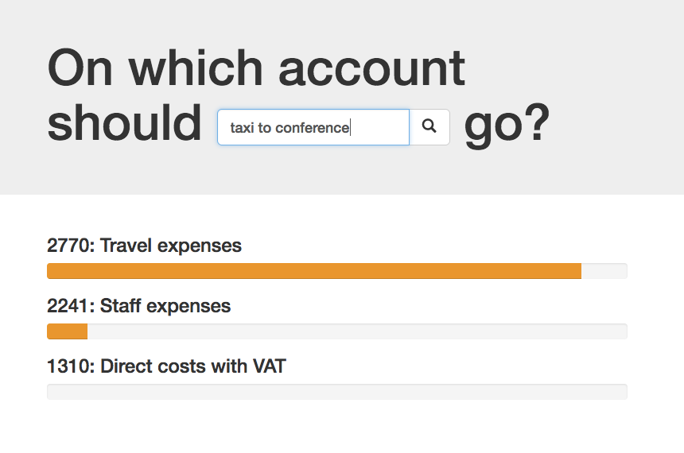

name: inverse
layout: true
class: center, middle, inverse

---
# Predictive services
## From data to production
<br>

Jonas Brunsgaard & Helge Munk Jakobsen   
.small[jonas.brunsgaard@visma.com]   
.small[helge.munk.jacobsen@visma.com]

September 4th, 2017 — PUDD   

.small[https://github.com/brunsgaard/berlin-talk-2017]   

---

layout: false

# Agenda

* Our team and our mission

* PART1: From **DATA** to **PREDICTION**

* PART2: From **PREDICTION** to **PRODUCTION**


---

# About us

* The Visma Machine Learning Team
* Located in Copenhagen (e-conomic office)
* Team headcount: 4
* Main focus: AutoSuggest

#### Helge Munk Jakobsen

* Interested in data and predictive modelling

#### Jonas Brunsgaard

* Interested in software arhitecture, elegant code and best practices
* Designing and building an upcomming end-to-end data science platform

---

template: inverse

# From **DATA** to **PREDICTION**

a gentle introduction to building predictive models aimed at developers

---

# Intro

Data -> Magic -> Prediction

---

# Intro

Data -> ~~Magic~~ Math + Code -> Prediction

---

# Hands on exercise

* **Goal:** Build account suggestion service

* **Example:** For "Taxi to conference" -> Travel expense account (maybe)

* No hardcoded rules

<br>.center[]

---

# The big picture

* Supervised learning (predictions)

* Classification

* One single type of model

<br>.center[]


---

layout: false

template: inverse

# Let's code!

---

layout: false

template: inverse

# From **PREDICTION**
# to **PRODUCTION**

---

# Let's get started
We could write a simple API endpoint that loads in data and trains the model.
<br><br>.center[]<br>

```python
@route('/predict')
def predict(request):
    model = Model()
    training_data = get_data()
    model.fit(training_data)  # fit means train
    return model.predict(request)
```

---

# What could possibly go wrong


```python
@route('/predict')
def predict(request):
    model = Model()
    training_data = get_data()
    model.fit(training_data)  # fit means train
    return model.predict(request)
```

--
count: false
 * Data availability
--
count: false
 * Data selection and preprocessing
--
count: false
 * Model training
--
count: false
 * Resource constraints
--
count: false

All in all this is just not a great solution!
---

# Pre-training, what is needed?

To build a __continuously updated prediction service__ we need:

--

* Data integration
  * _Extract_ data from the original data sources.
  * _Transform_ data into a _prepared dataset_
  * _Load_ the _prepared dataset_ into our data warehouse

.credit[See more https://en.wikipedia.org/wiki/Extract,_transform,_load]
 <!---
 Function consumer data to prepared data
 pr aggrement
--->

--

* Continuous model building
  * _Re-train_ models triggered on events
  * _Testing_ if the new model is sane
  * _Resource consumption_ should be monitored 
  * _Serialization_ and dezerialization ('environments must be identical')

---

# Pre-training, what is needed?

--

* Api package
  * Authentication
  * Schema validation
  * Model loading ('Environment mismatch')
  * Logging
  * Metrics
  * Packaging


--

* Operations platform
  * Codified provisioning
  * High availability
  * Zero downtime releases
  * Scalability
  * ...

---

# Continuous is the keyword

To sum it up we need three parts:


<br>.center[]<br>
<!---
Also we need an operations solution to make sure the whole service is available
-->

---

layout: false

template: inverse

# Getting data into the system

---

# The process of ETL

Extract, transform, load...

<br>.center[]


---

# Prepared datasets

We create a _prepared dataset_ per client/model/agreement, e.g.

.small[`e-conomic/nps-model/agreement552343`]

<br>
Data properties examples,

 * Entries are sorted by time stamp
 * Duplicates are removed
 * Maximum dataset size

<br>
Importing a dataset is now easy and can look like this.

```python
import datastore

# Fetching a dataset that are already prepared for the model
data = datastore.get('e-conomic/nps-model/agreement552343')
```


 <!---
What does the properties give us
 - Resource limits
 - Transfer speed assertions
 - Model training time assertions
--->

---

layout: false

template: inverse

# Training models

---

<!---

# Training Models

Depending on the model type, training might happen before or during call time.

* _User_ - small models are trained on _call time_ with a _prepared dataset_
* _Domain_ - bigger models are _pre-trained_ with a collection of _prepared datasets_
* _Mix_ - some domain models are modified with a _prepared dataset_ on _call time_

--->

# Challenges 

* Serializing trained python model objects
* Load in newly trained models into the api


--

We want to:

 * Ensure that the environment does not change
 * Ideally we would like to pack trained models with the api
 * Matrue model rollout procedure

<!---
 * Models are to us what data is to you
 --->


---

# Containers to the rescue

<br>.center[]


---

# Containers to the rescue

The container image holds
 * Api code
 * Serialized trained models (And the model code)
 * Dependencies


<br>.center[]<br>


---

# Dockerfile

A `Dockerfile` is used to describe how an image is build

.small[
```Dockerfile
FROM visma/machinelearning:1.1.4           # base image with c/c++ deps

RUN pip install vml-model-nps              # install deps
RUN pip install vml-api                    # install deps

RUN python train_models.py                 # train and serialize models 
RUN py.test --pyargs .                     # test the model and sanity

ENTRYPOINT ["python app.py"]               # run the application
```
]

<!---
Then save it to the registry

.small[
```bash
~ docker push vml.azurecr.io/model-nps:v2-1499177682
```
]
--->


---

layout: false

template: inverse

# Container orchestration
In Kubernetes we trust

---

# What is kubernetes

.center[]

--

.center[]


---


# Kubernetes

An example of a kuberentes configuration

.small[
```yaml
apiVersion: extensions/v1beta1
kind: Deployment
metadata:
  name: nps-model
spec:
  replicas: 3
  template:
    spec:
      containers:
      - name: nps-model
      - image: vml.azurecr.io/nps-model:v2-1499177682
        resources:
          requests:
            memory: "512Mi"
          limits:
            memory: "1024Mi"
        env:
        - name: AWS_CREDENTIALS
          valueFrom:
            secretKeyRef:
              name: nps-model-secrets
              key: aws_credentials
        ports:
        - containerPort: 80
```
]

---

# Putting it all together

_prepared datasets_ + scheduler = container images

<br>.center[]<br>

scheduler + kubernetes = containers

.center[]


<!---

## Docker and Kubernetes gave me

* Agile application creation and deployment
* Environmental consistency
* Dependency isolation
* Rolling updates
* Scaling thought in
* State configuration of services
* Dev and Ops separation of concerns

-->

---

## Deploying to playground environment from notebook

---

template: inverse

# Thanks!
