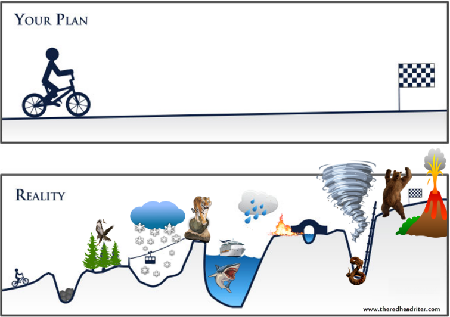

name: inverse
layout: true
class: center, middle, inverse

---
# Predictive services
## From data to production
<br>

Jonas Brunsgaard & Helge Munk Jakobsen   
.small[jonas.brunsgaard@visma.com]   
.small[helge.munk.jacobsen@visma.com]

September 4th, 2017 — PUDD   

.small[https://github.com/brunsgaard/berlin-talk-2017]   

---

layout: false

# Agenda

* Our team and our mission

* Going from data to prediction

 * Tools, techniques and processes

 * Magic explain while live coding

* From prediction to production

  * What goes into a hosted model (data, model, api, auth, metric, logging)

  * Where do we put stuff (the model is not part of the release, the model is like data, where should we load it from, s3, local)

  * Version misalignment, warming up the model, replacing a running model.

  * Why docker/kubernetes is a nice fit for the hosting part of this usecase

  * Lets deploy Helges model

* The idea of an end-to-end data science platform

* Conclusions

---

# About us

* Located in Copenhagen, e-conomic office

* We do Autosuggest and other custom solutions

#### Helge Munk Jakobsen

* Data wizard  TODO

#### Jonas Brunsgaard

* Interested in software arhitecture, elegant code and best practices

* Designing and building an upcomming end-to-end data science platform


---

template: inverse

# From data to prediction

---

# Helge section

---

layout: false

template: inverse

# From prediction to production

---

# The initial constraints

* Constant data ingress
* Python Sklearn (configuration)
* Testing
* Scaling

---

# The naive approach

We create a application that loads the data and trains the model on runtime. A
CI is testing the application and releases an artifact which is run on a VPS
in the cloud, A provisioning system is used to setup the VPS and install the
software.

<br>.center[]

---

# The naive approach

.center[]

```python
import api

app = api.create(name='Berlin')

@app.route('/predict', method=['POST'])
def predict(request):
    model = Model()  # Naive Bayes is O(n)
    training_data = db.get_all_observed_events()
    model.train(training_data)
    return m.predict(request.json)

app.run()
```

---

# The naive approach

The model Helge showed, is holding an internal matrix with the the features (in this case 20000 columns).
This means that for every new training data entry the matrix is growing with 20000 64bit integers.

This gives us an idea about the model growth

$$\frac{\frac{64}{8}}{2^{30}} \times 20000 = 0.00015\text{GB}$$
thus
$$y = 0.00015x$$


---

# The naive approach

This is worst case, but illustrates the problem

<br>.center[]

With sparse matrices we can get tremendous a improvement.

---

# The naive approach

Soon we experience that when data scales our solution starts to struggle

<br>.center[]

* Model training might be too slow and makes requests timeout
* Model training takes up an unhealthy amount of CPU time
* The server is running out of memory


---

# Pretraining models

<br>.center[]

---

# Pretraining models

<br>.center[]

---

# Pretraining models

* Conflicting versions

```python
import pickle

# 1. We define a model
class Model():

    def __init__(self, data):
        self.data = data

    def train(self):
        self.data  # access the data to train the mode

# 2. We create and train a model instance
model = Model(['i', 'am', 'the', 'data'])

# 3. We save the model instance
serialized_model = pickle.dumps(model)
```

---

```python
# 4. We update the model, due to a bug and release a patch
class Model():

    def __init__(self, training_data):
        self.training_data = training_data

    def train(self):
        self.trainign_data  # access the data to train the mode

# 5. In production we load in a model from s3
model = pickle.loads(serialized_model)

# 6. And when we access the attribute model_cls
model.train()
```


---

# Features of an end-to-end data science platform

* Python models immediately accessible via standard REST API requests without recoding from their native language.

* Embedding models into production apps is as simple as sending an autogenerated code snippet to your dev team. Embed predictive models in any application capable of making REST API requests.

* Make real-time predictions in low-latency applications or use batch mode for bulk offline scoring.


* Model Versioning and AB testing
* Unit Testing
* Deploy Anywhere (Docker)
* Run, Automate, and Track Data Science
* Bandit centralizes data science work, helping teams schedule remote jobs and track predictive models over time.
* Data Storage

---


# Components

* Hosting models
* Building models
* Managing data
* Feedback and Metrics
* Experiments
* Userbility

# Components
